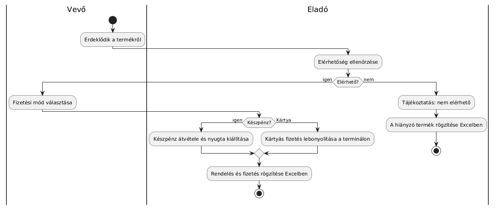
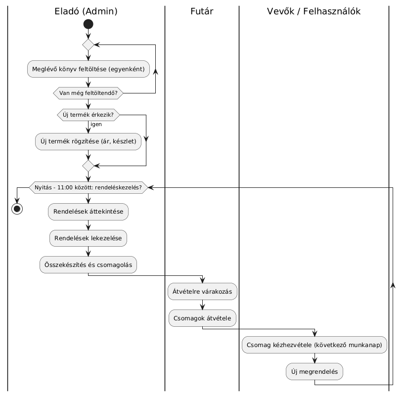

# Követelményspecifikáció

Egy könyvesbolt szeretne online megjelenést, így könnyebben tudna eljutni a vásárlókhoz.

## 1. Jelenlegi helyzet

Csak az üzletben történik vásárlás a bevétel növelése érdekében úgy döntöttek szeretnének az online térben is megjelenni, nemcsak a socail mediában de egy webshopot is szeretnének.

Fő problémák:
- nincs 0-24 rendelési lehetőség
- jó lenne ha a webshop egy fajta raktárkészlet kezelésre is tudnák használni
- lenne készletinformáció
- később szeretnének cikkeket is az oldalon a cél a marketing, SEO, analitika

## 2. Vágyálom rendszer leírása
Egy mobilra is optimalizált webshop, akár mobil first megközelítéssel.
Eleget tesz olyan feltételeknek, mint:

- a termék megvásárolható akár online fizetéssel / checkout folyamatok
- látható készletinformáció a termékekről
- vásárlásnál a készlet tartalma változik
- az áru beérkezésekor hozzátudnak adni új tételt: terméknév, leírás, kép, mennyiség
- létrehozhatnak olyan terméket ami nem készletes de előrendelhető, itt a szállításiidőt kell feltüntetni a frontend oldalon

Lényegében a backend eleget tegyen egy egyszerű de jól használható, korszerű webshopnak.

## 3. Jogszabályok és ajánlások

 - GDPR: adatkezelési tájékoztató szükséges, hozzájárulás stb.
 - Ászf, elállási jog
 - HTTPS is szükséges az oldalon

 ## 4. Jelenlegi üzleti folyamatok modellje

1. Vevő az üzletben érdeklődik.
2. Eladó közli elérhető a termék vagy nem.
3. Eladó manuálisan rögzíti a rendelést excel-ben.
4. Fizetés: készpénz vagy bankártya.

## 5. Az igényelt üzleti folyamat modellje
Eladó (Admin) folyamata:

- Feltölti a meglévő könyveket, jelenleg egyenként később lehet excel táblázatot szeretnének használni (export/import).
- Ha új termék jön, feltölti a terméket szintén az árát és a készletet.
- Átnézi a megrendeléseket általában nyitástól - 11:00-ig
- Lekezeli őket, elkészíti, csomagolja majd a futárra várnak a csomagok
- Másnap a vevő kézhez kapja a csomagot.

A vásárló (felhasználók) folyamata:

- A felhasználó az oldalon keresi a megfelelő könyvet
- Kiválasztja, majd kosárba teszi
- Majd checkout, bankártyás fizetéssel

## Követelménylista
| ID       | Verzió        |Név    | Kifjetés |
|----------|:-------------:|------:|---------:|
| K01 | V1.0 | Reszponzív megjelenés | Jó megjeleníthető legyen több képernyő felbontásban
| K02 | V1.0 | Termékek adminisztrációja | A felhasználó feltudja venni a termékeket
| K03 | V1.0 | Egyszerű UI | Minimális interakcióval is eltudjon jutni a fizetésig
| K04 | V1.0 | Checkout és fizetési módok | Még gondolkodnak rajta, valószínüleg Barion lesz

