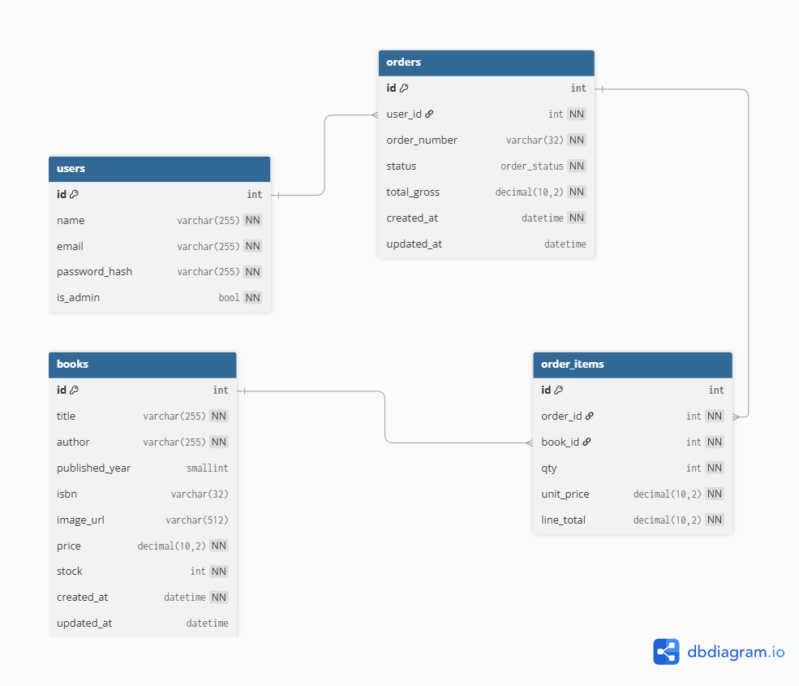

# Könyvesbolt webshop - rendszer rendszerspecifikációja

## A rendszer célja
Egy reszponzív weboldal a felhasználók részére, ahol könyveket tudnak vásárolni.
(Bővebben, lásd: követelményspecifikáció)

## Projektterv
### Résztvevők és szerepkörök:
| Scrum szerep  | Betöltő                    | Megjegyzés                                                                                   |
|---------------|----------------------------|----------------------------------------------------------------------------------------------|
| Scrum Master  | Elek László                | Kommunikáció a csapattagokkal, meeting-ek szervezése, feladatok átnézése, + taskok felvétele |
| Product Owner | Szombathely Könyv Abc Kft. | Kiss Andrea kapcsolattartó                                                                   |
| Dev Teams     | Csapat                     | -- Szervezés folyamatban --                                                                  |

### A DEV Teams tagjai:
| Név         | Betöltő                   | Feladatkör                              |
|-------------|---------------------------|-----------------------------------------|
| Elek László | Scrum master és fejlesztő | A taskok felvétele, CR és implementálás |

*További résztvevők szervezése még folyamatban*

## Üzleti folyamatok modellje
(Bővebben, lásd: követelményspecifikáció)

## A rendszer általános követelményei
- Webes felülettel rendelkezik, ami teljesen reszponzív.
- Az adattárolás MySQL adatbázisban történik.
- A rendszer megfelel a GDPR által előírt adatvédelmi szabályoknak.
- A felhasználó törölheti a tárolt adatait.
- Van lehetőség termék felvételre, ami megvásárolható

## Funkcionális terv

### Rendszerszereplők
- **Adminisztrátor**:
  - Termékek feltöltése, módosítása, törlése.
  - Rendelések kezelése.
  
- **Vásárló**:
  - Regisztráció, bejelentkezés.
  - Termékkatalógus böngészése.
  - Termékek kosárba helyezése és rendelés leadása.
  
### Rendszerhasználati esetek és lefutásaik
#### Adminisztrátor által elérhető funkciók
- Termékek felvitele az adatbázisba:
  - Terméknév, ár, leírás, kép feltöltése.
- Rendelések kezelése:
  - Rendelések állapotának frissítése (feldolgozás alatt, kiszállítva, teljesítve).
#### Adatvédelem
- Az adatokat titkosítva kell tárolni.
- Csak a szükséges adatokat kezelje a rendszer.

### Fizikai környezet és kialakítás
Az applikáció stackje:
- Legalább PHP8.1
- MYSQL 8
- Nginx

#### Fejlesztői követelmények, elvárások
- Konténrizáció, docker
- clean code fentartása
- CC, SOLID, DRY - kód ellenőrzők bevezetése: phpmd, phpstan, phpcs
- elkülönített rétegek, struktúrált felépítés

### Architektúrális tervek
#### Adatbázis terv

- Fontos, hogy termék tényleges törlése nem lehet, legyen inkább del flag.
- Ha a felhasználó törli a saját adatait a megrendeléseknek meg kell maradnia.

#### Szoftver terv
##### Az alkalmazás rétegei
Az alkalmazás egyszerűsége végett slim frameworkot használunk. Ez lehetőséget is nyújt abban az esetben ha bonyolultabb lenne a későbbiekben a termék.

Nem indokolt egyelőre a doctrine használata, ha az entitások száma a következő featurenél növekedne viszont érdemes lenne bevezetni. Az ORM alapú megközelítés könnyebbé tenné az sql használatát.

A view - megjelenítést mindenképpen bízuk template kezelőre, a fejlesztés könnyítése miatt -> twig.

Cél a bővíthetőség fenntartása és az MVC megközelítés megtartása.
#### Funkció terv
##### Vásárló/vendég funkciók
- **Bejelentkezés/regisztráció**:
  - Jelszócsere lehetőség.
- **Termékválasztás**:
  - Termékek kosárba helyezése.
- **Rendelések kezelése**:
  - Kosár tartalmának áttekintése.
  - Szállítási cím megadása.
  - Online fizetés.
##### Adminisztrátori funkciók
- **Termékek kezelése**:
  - Termékek felvitele, módosítása, törlése.
- **Rendelések kezelése**:
  - Rendelések állapotának frissítése.
##### Felhasználói funkciók URI szerint részletesen:
**USER/ANONYMOUS ROLE**
 - / - termékek listázása, üzlet bemutató - pár mondat
 - /konyvtar/{id} - kiválasztott termék részletek
 - /kosar - vásárolni kívánt termékek 
 - /kosar/hozaad/{id} - hozzáadás action
 - /kosar/frissit - kosárban mennyiség/törlés action
 - /fizetes - fizetési modul

**GUEST ROLE**
 - /bejelentkezes - csak guest/anonym felhasználóknak

**USER ROLE**
 - /kijelentkezes - csak azonosított felhasználóknak
 - /profil - felhasználók adatainak listázása
 - /profil/torles - felhasználó törlése

 **ADMIN ROLE**
 - /admin - dashboard, + később
 - /admin/konyv/uj - új könyv felvitele
 - /admin/konyv/{id}/szerkesztes - meglévő könyv szerkesztése
 - /admin/konyv/{id}/torles - könyv törlése, lehet del flagelni kéne

## Ütemterv

| Funkció                 | Feladat                               | Prioritás | Becslés (óra) | Aktuális becslés (óra) | Eltelt idő (óra) | Hátralévő idő (óra)  |
|-------------------------|---------------------------------------|----------|---------------|-------------------------|------------------|----------------------|
| Követelményspecifikáció | Követelményspecifikáció elkészítése   | 0        | 2             | 2                       | 2                | 0                    |
| Funkcionális specifikáció| Funkcionális specifikáció kidolgozása | 0       | 2             | 2                       | 2                | 0                    |
| Rendszerterv            | Rendszerterv megalkotása             | 0         | 3             | 3                       | 3                | 0                    |
| Adattárolás             | Adatmodell megtervezése              | 0         | 2             | 2                       | 2                | 0                    |
| Website                 | Képernyőtervek elkészítése/ menutree | 2         | 3             | 3                       | 0                | 3                    |
| Website                 | Fejlesztői környezet elkészítése     | 2         | 3             | 3                       | 0                | 3                    |
| Website                 | Alap projekt környezet elkészítése   | 2         | 3             | 3                       | 0                | 3                    |
| Website                 | Adatbázis létrehozása (migr., seed)  | 2         | 3             | 3                       | 0                | 3                    |
| Website                 | Menü + Kezdőlap elkészítése          | 2         | 3             | 3                       | 0                | 3                    |
| Website                 | Aloldal /book/{id} létrehozása       | 2         | 3             | 3                       | 0                | 3                    |
| Honlap                  | Login funkció megvalósítása          | 2         | 3             | 3                       | 0                | 3                    |
| Website                 | Kosárkezelési funkciók               | 2         | 3             | 3                       | 0                | 3                    |
| Website                 | Rendeléskezelési funkciók            | 2         | 3             | 3                       | 0                | 3                    |
| Website                 | Tesztelés                            | 2         | 5             | 5                       | 0                | 5                    |
